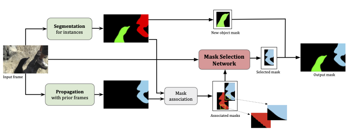
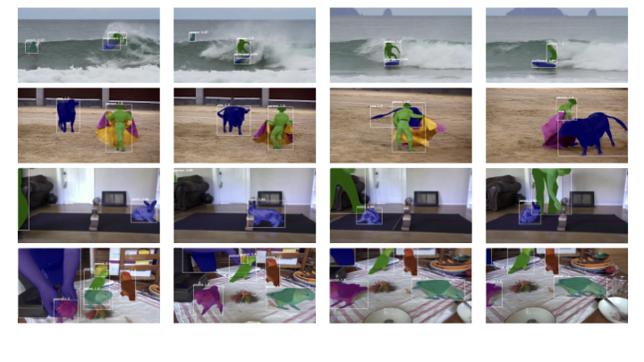

# Mask-Selection-Networks
[[**CVPRW 2021**](https://youtube-vos.org/assets/challenge/2021/reports/VIS_3_Goel.pdf)] [[**WACV**](https://openaccess.thecvf.com/content/WACV2021/papers/Garg_Mask_Selection_and_Propagation_for_Unsupervised_Video_Object_Segmentation_WACV_2021_paper.pdf)] [[**CVPRW 2020**](https://davischallenge.org/challenge2020/papers/DAVIS-Unsupervised-Challenge-1st-Team.pdf)]


This is the repo to host the code for mask selection based methods of video instance segmentation and the related problem of unsupervised video object segmentation. The method won various challenges such as [DAVIS 2020](https://davischallenge.org/challenge2020/index.html), [Youtube VIS 2021](https://youtube-vos.org). The code for our WACV paper can be found [here](https://github.com/vidit98/FrameSelect).


## Introduction
In this work we present a novel solution for Video Instance Segmentation(VIS), that is automatically generating
instance level segmentation masks along with object class
and tracking them in a video. Our method improves the
masks from segmentation and propagation branches in an
online manner using the **Mask Selection Network** (MSN)
hence limiting the noise accumulation during mask tracking. We propose an effective design of MSN by using
patch-based convolutional neural network. The network is
able to distinguish between very subtle differences between
the masks and choose the better masks out of the associated masks accurately. Further we make use of temporal
consistency and process the video sequences in both forward and reverse manner as a post processing step to recover lost objects. The proposed method can be used to
adapt any video object segmentation method for the task
of VIS. Our method achieves a score of 49.1 mAP on 2021
YouTube-VIS Challenge and was ranked third place among
more than 30 global teams.

## Method Overview



## Results



## Bibtex

Please cite the following papers if the work was helpful.
```
@inproceedings{garg2021mask,
  title={Mask Selection and Propagation for Unsupervised Video Object Segmentation},
  author={Garg, Shubhika and Goel, Vidit},
  booktitle={Proceedings of the IEEE/CVF Winter Conference on Applications of Computer Vision},
  pages={1680--1690},
  year={2021}
}
```
```
@article{DAVIS2020-Unsupervised-1st,
              author = {S. Garg, V. Goel, S. Kumar},
              title = {Unsupervised Video Object Segmentation using Online Mask Selection and Space-time Memory Networks},
              journal = {The 2020 DAVIS Challenge on Video Object Segmentation - CVPR Workshops},
              year = {2020}
}
```
            

